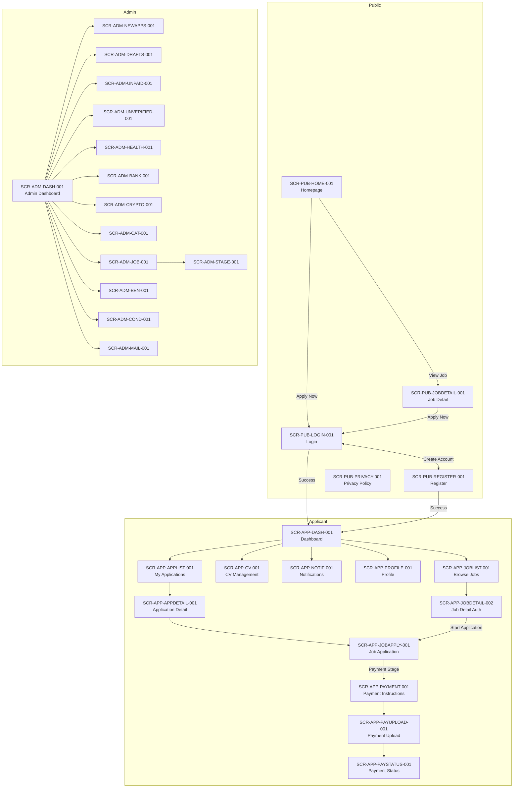

# USER INTERFACE DESIGN DESCRIPTION (UIDD)

**Document Status:** Draft  
**Version:** 1.0  
**Date:** 2026-04-13  
**Conformance:** ISO/IEC/IEEE 26514:2022 — Design of user documentation; ISO 9241-210:2019 — Human-centred design; IEEE 1016:2009 — Software Design Description (UI viewpoint)  
**Upstream Documents:**  
- [strs.md](file:///home/udorakpuenyi/job_agency/docs/strs.md) (StRS STAKE-JOBAGENCY-001)  
- [screen_inventory.md](file:///home/udorakpuenyi/job_agency/docs/screen_inventory.md) (45-screen inventory)

---

## 1.0 PURPOSE & SCOPE

This User Interface Design Description (UIDD) defines the architecture, structure, behaviour, and interaction design for every screen in the Job Agency platform. Each design element traces **backward** to:
1. Screen Inventory (SCR-xxx) — *which screen*
2. StRS Requirements (STK-xxx, DM-xxx, TRUST-xxx, NFR-xxx) — *why the screen exists*

**Traceability chain:** UIDD → Screen Inventory → StRS (backward per ISO/IEC/IEEE 29148:2018 §6.6).

---

## 2.0 DESIGN SYSTEM FOUNDATION

### 2.1 Typography

| Element | Font | Weight | Size | Line Height |
|---------|------|--------|------|-------------|
| H1 (Page title) | Inter | 700 | 28px | 36px |
| H2 (Section title) | Inter | 600 | 22px | 28px |
| H3 (Sub-section) | Inter | 600 | 18px | 24px |
| Body | Inter | 400 | 14px | 20px |
| Body Small | Inter | 400 | 12px | 16px |
| Label | Inter | 500 | 12px | 16px |
| Button | Inter | 600 | 14px | 20px |
| Caption | Inter | 400 | 11px | 14px |

**Traceability:** DM-002 (professional branding), TRUST-002 (admin legitimacy — polished presentation)

### 2.2 Colour Palette

| Token | Hex | Usage |
|-------|-----|-------|
| `--primary` | #2563EB | Primary actions, links, active states |
| `--primary-hover` | #1D4ED8 | Primary button hover |
| `--secondary` | #64748B | Secondary text, icons |
| `--success` | #16A34A | Payment verified, stage complete, success toast |
| `--warning` | #D97706 | Pending states, warnings |
| `--danger` | #DC2626 | Errors, rejected, delete actions |
| `--surface` | #FFFFFF | Card backgrounds, form fields |
| `--background` | #F8FAFC | Page background |
| `--border` | #E2E8F0 | Borders, dividers |
| `--text-primary` | #0F172A | Primary text |
| `--text-secondary` | #475569 | Supporting text |
| `--admin-accent` | #7C3AED | Admin-domain visual differentiation |

**Traceability:** DM-002 (professional branding), DM-007 (progress motivation — green for success)

### 2.3 Spacing Scale

| Token | Value | Usage |
|-------|-------|-------|
| `--space-xs` | 4px | Inline icon gaps |
| `--space-sm` | 8px | Input padding, tight gaps |
| `--space-md` | 16px | Card padding, section gaps |
| `--space-lg` | 24px | Section separators |
| `--space-xl` | 32px | Page section padding |
| `--space-2xl` | 48px | Major layout gaps |

### 2.4 Elevation / Shadow

| Level | Value | Usage |
|-------|-------|-------|
| Level 0 | none | Flat elements |
| Level 1 | `0 1px 3px rgba(0,0,0,0.1)` | Cards, table rows on hover |
| Level 2 | `0 4px 12px rgba(0,0,0,0.1)` | Dropdowns, modals |
| Level 3 | `0 8px 24px rgba(0,0,0,0.15)` | Toast notifications, overlays |

### 2.5 Border Radius

| Token | Value | Usage |
|-------|-------|-------|
| `--radius-sm` | 4px | Buttons, badges |
| `--radius-md` | 8px | Cards, form inputs |
| `--radius-lg` | 12px | Modals, major containers |
| `--radius-full` | 9999px | Avatars, pills |

### 2.6 Breakpoints (Responsive)

| Breakpoint | Width | Target |
|------------|-------|--------|
| Mobile | < 640px | Smartphones |
| Tablet | 640px – 1024px | Tablets |
| Desktop | > 1024px | Desktop browsers |

**Traceability:** NFR-PERF-002 (homepage loads in ≤ 2s — responsive images/layouts reduce payload on mobile)

---

## 3.0 GLOBAL UI COMPONENTS

### 3.1 Navigation — Public Header

| Property | Specification |
|----------|--------------|
| **Screens** | SCR-PUB-HOME-001, SCR-PUB-JOBDETAIL-001, SCR-PUB-LOGIN-001, SCR-PUB-REGISTER-001, SCR-PUB-PRIVACY-001 |
| **Layout** | Fixed top bar, 64px height, full width |
| **Left** | Agency logo + name (links to `/`) |
| **Centre** | Navigation links: Home, Jobs, Privacy Policy |
| **Right** | "Login" / "Sign Up" buttons |
| **Mobile** | Hamburger menu collapsing centre+right into slide-out drawer |
| **Traceability** | DM-002 (professional branding), DM-008 (agency credentials), TRUST-002 (legitimacy), TRUST-006 (privacy policy link on every page) |

### 3.2 Navigation — Applicant Sidebar

| Property | Specification |
|----------|--------------|
| **Screens** | All SCR-APP-* screens |
| **Layout** | Fixed left sidebar, 240px width on desktop; bottom tab bar on mobile |
| **Items** | Dashboard, My Applications, Browse Jobs, CV Management, Notifications, Profile |
| **Active indicator** | Left border accent + background highlight |
| **Badge** | Unread notification count on Notifications link; unpaid payment count on Dashboard |
| **Footer** | Support email/phone, Logout link |
| **Traceability** | TRUST-010 (support contact visible), STK-APP-DASH-001 (dashboard access) |

### 3.3 Navigation — Admin Sidebar

| Property | Specification |
|----------|--------------|
| **Screens** | All SCR-ADM-* screens |
| **Layout** | Fixed left sidebar, 260px width, collapsible to 60px icon-only mode |
| **Sections** | |

| Section | Items |
|---------|-------|
| Overview | Dashboard |
| Applications | New Applications, Drafts |
| Payments | Unpaid Payments, Unverified Payments |
| Job Management | Job Listings, Categories, Benefits, Conditions |
| Finance | Bank Accounts, Crypto Wallets |
| Communication | Mail Applicant |
| System | Health Dashboard |

| **Active indicator** | Left `--admin-accent` border + background |
| **Traceability** | NFR-SEC-004 (RBAC — admin-only access), STK-ADM-APP-001..004, STK-ADM-PAY-003..004 |

### 3.4 Data Table Component

| Property | Specification |
|----------|--------------|
| **Screens** | SCR-ADM-BANK-001, SCR-ADM-CRYPTO-001, SCR-ADM-CAT-001, SCR-ADM-JOB-001, SCR-ADM-BEN-001, SCR-ADM-COND-001, SCR-ADM-NEWAPPS-001, SCR-ADM-DRAFTS-001, SCR-ADM-UNPAID-001, SCR-ADM-UNVERIFIED-001 |
| **Pagination** | 20 rows per page, page controls (prev/next, page number, total count) |
| **Features** | Sortable columns (click header), search/filter bar, row actions (edit, delete, view), bulk selection (optional), empty state message |
| **Loading** | Skeleton rows (shimmer) during fetch |
| **Responsive** | Horizontal scroll on mobile; priority columns shown first |
| **Traceability** | NFR-PERF-004 (20 items per page, loads ≤ 1s), TRUST-003 (loading feedback) |

### 3.5 Form Component System

| Property | Specification |
|----------|--------------|
| **Screens** | All *FORM* screens (SCR-ADM-BANKFORM-001, SCR-ADM-CRYPTOFORM-001, etc.), SCR-PUB-LOGIN-001, SCR-PUB-REGISTER-001 |
| **Input states** | Default, Focused (blue border), Error (red border + message), Disabled (grey bg) |
| **Validation** | Real-time inline validation; error messages below input; form-level error summary |
| **Submit behaviour** | Loading spinner on button during submit; disable button to prevent double-submit; success toast on completion |
| **Traceability** | TRUST-003 (immediate feedback), DM-003 (real-time confirmations) |

### 3.6 Toast / Notification System

| Property | Specification |
|----------|--------------|
| **Screen** | SCR-SYS-TOAST-001 (global overlay) |
| **Position** | Top-right, stacked vertically |
| **Variants** | Success (green), Error (red), Warning (amber), Info (blue) |
| **Auto-dismiss** | 5 seconds for success/info; persistent for error/warning (manual dismiss) |
| **Push notification popup** | Distinctive style with icon; click-through to relevant screen |
| **Animation** | Slide in from right, fade out |
| **Traceability** | DM-003 (real-time confirmations), TRUST-003 (immediate feedback within 500ms), STK-APP-NOTIF-002 (push notifications) |

### 3.7 Progress Tracker Component

| Property | Specification |
|----------|--------------|
| **Screens** | SCR-APP-JOBAPPLY-001, SCR-APP-APPDETAIL-001, SCR-APP-DASH-001, SCR-APP-APPLIST-001 |
| **Layout** | Horizontal step indicator (desktop); vertical on mobile |
| **States per step** | Completed (green checkmark), Current (blue filled circle, pulsing), Upcoming (grey outline circle), Payment Required (dollar icon badge) |
| **Labels** | Stage name; "Paid ✓" or "Payment Required" sub-label |
| **Motivation text** | Below tracker: "Stage X of Y complete — you're almost there!" |
| **Traceability** | DM-001 (clear progress tracker), DM-007 (progress motivation), TRUST-005 (percentage completion, celebratory messaging), STK-APP-APPLY-002 (sequential stages), STK-APP-APPLY-003 (payment indication) |

### 3.8 File Upload Component

| Property | Specification |
|----------|--------------|
| **Screens** | SCR-APP-CV-001, SCR-APP-PAYUPLOAD-001 |
| **Layout** | Dashed-border dropzone with cloud-upload icon |
| **Behaviour** | Drag-and-drop OR click to browse; file type validation; size validation; preview (thumbnail for images, icon for docs) |
| **Progress** | Upload progress bar (0–100%); percent text |
| **States** | Empty, Dragging over, File selected (preview), Uploading, Success, Error |
| **Traceability** | STK-APP-CV-002..003 (CV format/size), STK-APP-PAY-002..003 (screenshot format/size), TRUST-007 (immediate confirmation), DM-003 (real-time confirmation) |

### 3.9 Status Badge Component

| Property | Specification |
|----------|--------------|
| **Screens** | SCR-APP-PAYSTATUS-001, SCR-APP-APPLIST-001, SCR-ADM-UNPAID-001, SCR-ADM-UNVERIFIED-001 |
| **Variants** | |

| Badge | Colour | Icon |
|-------|--------|------|
| Pending | `--warning` bg, dark text | Clock icon |
| Verified / Paid | `--success` bg, white text | Checkmark icon |
| Rejected / Unpaid | `--danger` bg, white text | X icon |
| Draft | Grey bg, dark text | Pencil icon |
| Active | `--primary` bg, white text | Dot icon |

| **Traceability** | STK-APP-PAY-004 (payment status display), STK-ADM-PAY-001 (paid/unpaid marking) |

### 3.10 Modal / Dialog Component

| Property | Specification |
|----------|--------------|
| **Usage** | Delete confirmations, screenshot lightbox (SCR-ADM-UNVERIFIED-001), mail compose overlay (SCR-ADM-MAIL-001) |
| **Overlay** | Semi-transparent black backdrop (rgba(0,0,0,0.5)) |
| **Size** | Small (400px), Medium (600px), Large (800px) |
| **Actions** | Confirm/Cancel button pair; destructive confirm in red |
| **Keyboard** | Escape to close; Tab trap within modal |
| **Traceability** | TRUST-003 (immediate feedback), NFR-SEC-006 (signed URL screenshot display in lightbox) |

---

## 4.0 SCREEN-LEVEL DESIGN SPECIFICATIONS

### 4.1 Public Domain

#### 4.1.1 SCR-PUB-HOME-001 — Homepage

```
┌─────────────────────────────────────────────────────────────────┐
│  [Logo] Agency Name        Home | Jobs | Privacy    [Login][Signup] │  ← Public Header
├─────────────────────────────────────────────────────────────────┤
│                                                                   │
│   ┌─────────────────────────────────────────────────────────┐   │
│   │              HERO SECTION                                │   │
│   │  Agency headline text (H1)                               │   │
│   │  Sub-headline describing services                        │   │
│   │  Trust badges: [✓ Verified] [✓ Secure] [✓ Licensed]     │   │
│   │                              [Browse Jobs ↓]             │   │
│   └─────────────────────────────────────────────────────────┘   │
│                                                                   │
│   Category Filter: [All] [IT] [Healthcare] [Finance] ...         │
│   Search: [Search jobs...                            ] [🔍]       │
│                                                                   │
│   ┌──────────────┐ ┌──────────────┐ ┌──────────────┐           │
│   │ Job Card     │ │ Job Card     │ │ Job Card     │           │
│   │ Title        │ │ Title        │ │ Title        │           │
│   │ Location     │ │ Location     │ │ Location     │           │
│   │ Category     │ │ Category     │ │ Category     │           │
│   │ Emp Type     │ │ Emp Type     │ │ Emp Type     │           │
│   │ [Apply Now]  │ │ [Apply Now]  │ │ [Apply Now]  │           │
│   └──────────────┘ └──────────────┘ └──────────────┘           │
│                                                                   │
│   [← Prev] Page 1 of N [Next →]                                 │
│                                                                   │
├─────────────────────────────────────────────────────────────────┤
│  Footer: Agency address | Phone | Email | Social links           │
│  © 2026 Agency Name | Privacy Policy | Terms of Service          │
└─────────────────────────────────────────────────────────────────┘
```

| Behaviour | Specification |
|-----------|--------------|
| **Initial load** | SSR (Next.js) — job listings fetched server-side, cached 5 min (Redis) |
| **Category filter** | Client-side filter on cached data; API refetch if > 5 min since load |
| **"Apply Now" click** | If unauthenticated → navigate to `/login?redirect=/jobs/:jobId/apply`; if authenticated → navigate to `/dashboard/applications/:jobId/apply` |
| **Responsive** | 3 columns (desktop), 2 columns (tablet), 1 column (mobile) |
| **Performance** | ≤ 2s load (NFR-PERF-002); skeleton loading during data fetch |
| **Backward trace** | STK-APP-AUTH-001, STK-APP-AUTH-003, STK-ADM-JOB-004, STK-ADM-CAT-003, DM-002, DM-008, TRUST-002, TRUST-006, TRUST-009, TRUST-010, NFR-PERF-002 |

---

#### 4.1.2 SCR-PUB-JOBDETAIL-001 — Job Detail Page

```
┌────────────────────────────────────────────────────────────────┐
│  [Public Header]                                                │
├────────────────────────────────────────────────────────────────┤
│  ← Back to Jobs                                                │
│                                                                  │
│  [Category Badge]  [Employment Type Badge]                      │
│  Job Title (H1)                                                  │
│  📍 Location                                                     │
│                                                                  │
│  ┌──── Description ──────────────────────────────────────────┐ │
│  │ Full job description rich text                             │ │
│  └────────────────────────────────────────────────────────────┘ │
│                                                                  │
│  ┌──── Benefits ─────────────────────────────────────────────┐ │
│  │ 💰 Salary: $XX,XXX/yr  │  🏖 PTO: XX days                │ │
│  │ 🏥 Health Insurance     │  🚚 Relocation Assistance       │ │
│  └────────────────────────────────────────────────────────────┘ │
│                                                                  │
│  ┌──── Conditions ───────────────────────────────────────────┐ │
│  │ • Condition 1                                              │ │
│  │ • Condition 2                                              │ │
│  └────────────────────────────────────────────────────────────┘ │
│                                                                  │
│  ┌──── Application Stages & Costs ───────────────────────────┐ │
│  │ Stage 1: Document Review           — Free                  │ │
│  │ Stage 2: Processing Fee            — $XXX                  │ │
│  │ Stage 3: Visa Coordination         — $X,XXX                │ │
│  │ ─────────────────────────────────────────────               │ │
│  │ Total Estimated Cost: $X,XXX                               │ │
│  └────────────────────────────────────────────────────────────┘ │
│                                                                  │
│  [Apply Now — Start Application]                                │
│                                                                  │
│  [Footer]                                                        │
└────────────────────────────────────────────────────────────────┘
```

| Behaviour | Specification |
|-----------|--------------|
| **Cost disclosure** | All payment stages and total cost shown before "Apply Now" |
| **"Apply Now" click** | Unauthenticated → `/login?redirect=/jobs/:jobId/apply` |
| **Backward trace** | STK-APP-APPLY-001, STK-ADM-BEN-004, STK-ADM-COND-003, STK-APP-APPLY-003, DM-004, DM-005, TRUST-009, TRUST-006 |

---

#### 4.1.3 SCR-PUB-LOGIN-001 — Login Page

```
┌─────────────────────────────────────────┐
│  [Public Header]                         │
├─────────────────────────────────────────┤
│                                           │
│     ┌─────────────────────────────┐     │
│     │      [Agency Logo]           │     │
│     │    Welcome Back              │     │
│     │                              │     │
│     │  [  Sign in with Google  ]   │     │
│     │                              │     │
│     │  ──── or ────                │     │
│     │                              │     │
│     │  Email                       │     │
│     │  [_________________________] │     │
│     │                              │     │
│     │  Password                    │     │
│     │  [__________________] [👁]   │     │
│     │                              │     │
│     │  ⚠ Rate limit warning        │     │
│     │     (shown after 3 fails)    │     │
│     │                              │     │
│     │  [       Login       ]       │     │
│     │                              │     │
│     │  Forgot password?            │     │
│     │  Don't have an account?      │     │
│     │  Create one →                │     │
│     └─────────────────────────────┘     │
│                                           │
│  [Footer]                                 │
└─────────────────────────────────────────┘
```

| Behaviour | Specification |
|-----------|--------------|
| **Google OAuth** | Opens Google consent screen; on success, creates/authenticates user |
| **Email/Password** | Client-side validation → API call → JWT + refresh token stored |
| **Rate limiting** | After 3 failed attempts: warning shown; after 5 per 15 min per IP: locked (NFR-SEC-008) |
| **Redirect** | On success → `redirect` query param destination or `/dashboard` |
| **Backward trace** | STK-APP-AUTH-003, STK-APP-AUTH-004, STK-APP-AUTH-005, NFR-SEC-008, DM-002 |

---

#### 4.1.4 SCR-PUB-REGISTER-001 — Registration Page

```
┌─────────────────────────────────────────┐
│  [Public Header]                         │
├─────────────────────────────────────────┤
│     ┌─────────────────────────────┐     │
│     │      [Agency Logo]           │     │
│     │    Create Your Account       │     │
│     │                              │     │
│     │  [ Sign up with Google  ]    │     │
│     │                              │     │
│     │  ──── or ────                │     │
│     │                              │     │
│     │  Full Name                   │     │
│     │  [_________________________] │     │
│     │                              │     │
│     │  Email                       │     │
│     │  [_________________________] │     │
│     │                              │     │
│     │  Password       [Strength:■■□□□]│  │
│     │  [_________________________] │     │
│     │  ✓ 8+ chars ✗ uppercase      │     │
│     │  ✓ lowercase ✗ special char  │     │
│     │                              │     │
│     │  Confirm Password            │     │
│     │  [_________________________] │     │
│     │                              │     │
│     │  ☐ I agree to the Privacy    │     │
│     │    Policy and Terms          │     │
│     │                              │     │
│     │  [      Register      ]      │     │
│     │                              │     │
│     │  Already have an account?    │     │
│     │  Login →                     │     │
│     └─────────────────────────────┘     │
└─────────────────────────────────────────┘
```

| Behaviour | Specification |
|-----------|--------------|
| **Password policy** | Min 8 chars, 1 uppercase, 1 lowercase, 1 digit, 1 special — real-time indicators |
| **Privacy checkbox** | Required; links open privacy policy (SCR-PUB-PRIVACY-001) in new tab |
| **On success** | Create account → auto-login → redirect to destination or dashboard |
| **Backward trace** | STK-APP-AUTH-004, STK-APP-AUTH-005, NFR-SEC-002, TRUST-006, REG-002 |

---

### 4.2 Applicant Domain

#### 4.2.1 SCR-APP-DASH-001 — Applicant Dashboard

```
┌──────┬────────────────────────────────────────────────────────┐
│      │  Dashboard                        🔔(3)  [Profile ▼]  │
│  S   ├────────────────────────────────────────────────────────┤
│  I   │                                                        │
│  D   │  Welcome back, [Name]! 👋                              │
│  E   │                                                        │
│  B   │  ┌────────────┐ ┌────────────┐ ┌───────────────┐     │
│  A   │  │ Pending     │ │ Unpaid     │ │ Active        │     │
│  R   │  │ Stages: 3   │ │ Payments: 2│ │ Applications:4│     │
│      │  └────────────┘ └────────────┘ └───────────────┘     │
│      │                                                        │
│      │  ── Active Applications ──────────────────────────    │
│      │  ┌─────────────────────────────────────────────┐     │
│      │  │ Job Title A                                  │     │
│      │  │ ○──●──○──○──○  Stage 2/5  (40%)             │     │
│      │  │ "Stage 2 of 5 complete — keep going!"       │     │
│      │  │ Action: Complete Stage 3  [Continue →]       │     │
│      │  └─────────────────────────────────────────────┘     │
│      │  ┌─────────────────────────────────────────────┐     │
│      │  │ Job Title B                                  │     │
│      │  │ ○──○──●  Stage 1/3  — Payment Due: $500     │     │
│      │  │ [Make Payment →]                             │     │
│      │  └─────────────────────────────────────────────┘     │
│      │                                                        │
│      │  ── Available Jobs ────────────────────               │
│      │  [Job cards — same as homepage but with "Apply"]      │
│      │                                                        │
│      │  Need help? 📧 support@agency.com | 📞 +1-XXX-XXX    │
└──────┴────────────────────────────────────────────────────────┘
```

| Behaviour | Specification |
|-----------|--------------|
| **Summary widgets** | Real-time counters fetched on load + WebSocket/SSE updates |
| **Progress trackers** | Per-application; clickable → SCR-APP-APPDETAIL-001 |
| **Motivation text** | Dynamic based on stage count |
| **Performance** | ≤ 3s render (NFR-PERF-003); aggregation query cached 2 min |
| **Backward trace** | STK-APP-AUTH-002, STK-APP-DASH-001..003, DM-001, DM-007, TRUST-005, TRUST-010, NFR-PERF-003 |

---

#### 4.2.2 SCR-APP-JOBAPPLY-001 — Job Application Page

```
┌──────┬───────────────────────────────────────────────────────┐
│      │ Apply: [Job Title]                                     │
│  S   ├───────────────────────────────────────────────────────┤
│  I   │                                                         │
│  D   │  Progress: ○──●──○──○──○   Stage 2 of 5               │
│  E   │  "You're making great progress!" 🎉                    │
│  B   │                                                         │
│  A   │  ┌──── Current Stage: Processing ─────────────────┐   │
│  R   │  │                                                  │   │
│      │  │  Instructions: [stage-specific instructions]     │   │
│      │  │                                                  │   │
│      │  │  [Form fields as required by this stage]         │   │
│      │  │                                                  │   │
│      │  │  💰 This stage requires payment: $500            │   │
│      │  │  [Proceed to Payment →]                          │   │
│      │  │                                                  │   │
│      │  │  OR                                              │   │
│      │  │                                                  │   │
│      │  │  [Complete Stage ✓]   [Save Draft]               │   │
│      │  └──────────────────────────────────────────────────┘   │
│      │                                                         │
│      │  ┌──── Completed Stages ──────────────────────────┐   │
│      │  │ ✓ Stage 1: Document Review — Completed 04/10   │   │
│      │  └────────────────────────────────────────────────┘   │
│      │                                                         │
│      │  ┌──── Upcoming Stages ───────────────────────────┐   │
│      │  │ ○ Stage 3: Visa Coordination — $1,500          │   │
│      │  │ ○ Stage 4: Final Review — Free                 │   │
│      │  │ ○ Stage 5: Offer — Free                        │   │
│      │  └────────────────────────────────────────────────┘   │
└──────┴───────────────────────────────────────────────────────┘
```

| Behaviour | Specification |
|-----------|--------------|
| **Stage progression** | Only current stage form is interactive; completed are read-only summary; upcoming are preview-only |
| **Payment stage** | "Proceed to Payment" → SCR-APP-PAYMENT-001 |
| **Save Draft** | Persists current form state; applicant can resume later |
| **Auto-save** | Every 30 seconds while form is active |
| **Backward trace** | STK-APP-AUTH-005, STK-APP-APPLY-002..005, DM-001, DM-004, DM-007, TRUST-005 |

---

#### 4.2.3 SCR-APP-PAYMENT-001 — Payment Instructions

```
┌──────┬────────────────────────────────────────────────────────┐
│      │ Payment Required: Stage 2 — Processing Fee             │
│  S   ├────────────────────────────────────────────────────────┤
│  I   │                                                         │
│  D   │  💰 Amount Due: $500.00 USD                            │
│  E   │                                                         │
│  B   │  📋 Purpose: Processing fee for application review     │
│  A   │                                                         │
│  R   │  ── Bank Transfer (Open Beneficiary) ─────────────    │
│      │  Bank: First National Bank                              │
│      │  Account: XXXX-XXXX-XXXX                               │
│      │  Routing: XXXXXX                                        │
│      │  Reference: APP-[ID]-STG-2                              │
│      │                                                         │
│      │  ── Cryptocurrency ───────────────────────            │
│      │  ┌──────────────┐ ┌──────────────┐                    │
│      │  │ BTC          │ │ ETH          │                    │
│      │  │ [address]    │ │ [address]    │                    │
│      │  │ [Copy 📋]    │ │ [Copy 📋]    │                    │
│      │  └──────────────┘ └──────────────┘                    │
│      │                                                         │
│      │  ⏱ Estimated verification time: within 4 hours         │
│      │                                                         │
│      │  [Upload Payment Proof →]                               │
│      │                                                         │
│      │  Need help? 📧 support@agency.com                      │
└──────┴────────────────────────────────────────────────────────┘
```

| Behaviour | Specification |
|-----------|--------------|
| **Bank type logic** | Amount < $4,999 → show Open Beneficiary accounts; ≥ $5,000 → show Normal accounts |
| **Crypto wallets** | Show all active wallets with copy-to-clipboard |
| **"Upload Payment Proof"** | Navigate to SCR-APP-PAYUPLOAD-001 |
| **Backward trace** | STK-APP-PAY-001, STK-ADM-BANK-002..003, STK-ADM-CRYPTO-003, DM-005, TRUST-001, TRUST-007, TRUST-010 |

---

#### 4.2.4 SCR-APP-PAYUPLOAD-001 — Payment Proof Upload

```
┌──────┬────────────────────────────────────────────────────────┐
│      │ Upload Payment Proof                                    │
│  S   ├────────────────────────────────────────────────────────┤
│  I   │                                                         │
│  D   │  Stage: Processing Fee — $500.00                       │
│  E   │                                                         │
│  B   │  ┌─ ─ ─ ─ ─ ─ ─ ─ ─ ─ ─ ─ ─ ─ ─ ─ ─ ─ ─ ─ ─ ─┐   │
│  A   │  ┊                                                ┊   │
│  R   │  ┊       ☁ Drag & drop your file here            ┊   │
│      │  ┊            or click to browse                  ┊   │
│      │  ┊                                                ┊   │
│      │  ┊   Accepted: JPEG, PNG, PDF  •  Max: 10MB      ┊   │
│      │  └─ ─ ─ ─ ─ ─ ─ ─ ─ ─ ─ ─ ─ ─ ─ ─ ─ ─ ─ ─ ─ ─┘   │
│      │                                                         │
│      │  [Preview of selected file]                             │
│      │  ████████████████░░░░ 67% uploading...                  │
│      │                                                         │
│      │  [Submit Proof]   [Cancel]                               │
│      │                                                         │
│      │  After submission:                                      │
│      │  ┌─────────────────────────────────────────────────┐   │
│      │  │ ✅ Payment proof received!                       │   │
│      │  │ Your proof is #12 in the verification queue.    │   │
│      │  │ Estimated turnaround: within 4 hours.           │   │
│      │  │ You'll be notified by email and push.           │   │
│      │  │ [Back to Application →]                         │   │
│      │  └─────────────────────────────────────────────────┘   │
│      │                                                         │
└──────┴────────────────────────────────────────────────────────┘
```

| Behaviour | Specification |
|-----------|--------------|
| **Validation** | Client-side: file type (JPEG, PNG, PDF) + size (≤ 10MB) before upload |
| **Upload** | Progress bar; on success → confirmation with queue position |
| **Server-side** | Malware scan (NFR-SEC-005); store in private bucket (NFR-SEC-006) |
| **Backward trace** | STK-APP-PAY-002..003, DM-003, TRUST-003, TRUST-007 |

---

#### 4.2.5 SCR-APP-APPDETAIL-001 — Application Detail / Timeline

```
┌──────┬────────────────────────────────────────────────────────┐
│      │ Application: [Job Title]                                │
│  S   ├────────────────────────────────────────────────────────┤
│  I   │                                                         │
│  D   │  Progress: ●──●──◐──○──○  Stage 3/5 (60%)             │
│  E   │  "You're past halfway — keep going!" 🎉                │
│  B   │                                                         │
│  A   │  ── Stage Summary ────────────────────────────        │
│  R   │  ✓ Stage 1: Document Review          04/08 10:30      │
│      │  ✓ Stage 2: Processing Fee (Paid ✓)  04/09 14:22      │
│      │  ◐ Stage 3: Visa Coordination        In Progress      │
│      │  ○ Stage 4: Final Review             Upcoming         │
│      │  ○ Stage 5: Offer                    Upcoming         │
│      │                                                         │
│      │  ── Activity Timeline ─────────────────────────       │
│      │  ┌─────────────────────────────────────────────┐      │
│      │  │ 📅 04/10 09:15  Payment proof uploaded       │      │
│      │  │ 📅 04/09 14:22  Stage 2 payment verified    │      │
│      │  │ 📅 04/09 11:00  Payment proof submitted     │      │
│      │  │ 📅 04/08 10:30  Stage 1 completed           │      │
│      │  │ 📅 04/07 16:45  Application submitted       │      │
│      │  └─────────────────────────────────────────────┘      │
│      │                                                         │
│      │  [Continue Application →]                               │
└──────┴────────────────────────────────────────────────────────┘
```

| Behaviour | Specification |
|-----------|--------------|
| **Timeline** | Chronological, most recent first; real-time updates via WebSocket/SSE |
| **Click-through** | "Continue Application" → SCR-APP-JOBAPPLY-001 at current stage |
| **Backward trace** | STK-APP-DASH-003, STK-APP-APPLY-002, DM-001, DM-006, DM-007, TRUST-004, TRUST-005 |

---

### 4.3 Admin Domain

#### 4.3.1 SCR-ADM-DASH-001 — Admin Dashboard

```
┌──────────┬────────────────────────────────────────────────────┐
│          │ Admin Dashboard                                     │
│  A       ├────────────────────────────────────────────────────┤
│  D       │                                                     │
│  M       │ ┌──────────┐ ┌──────────┐ ┌──────────┐ ┌────────┐│
│  I       │ │ New Apps  │ │ Unpaid   │ │Unverified│ │ Drafts ││
│  N       │ │    12     │ │ Payments │ │ Payments │ │   8    ││
│          │ │           │ │    7     │ │    5     │ │        ││
│  S       │ └──[View]──┘ └──[View]──┘ └──[View]──┘ └─[View]─┘│
│  I       │                                                     │
│  D       │ ── System Health ─────────────── ── Quick Actions ─│
│  E       │ CPU: 42% ████░░░░░   [OK]       │ [+ New Job]     │
│  B       │ MEM: 58% ██████░░░   [OK]       │ [Mail Applicant]│
│  A       │ DB:  18/30 ██████░░  [OK]       │ [View Payments] │
│  R       │                                                     │
│          │ ── Recent Activity ─────────────────────────       │
│          │ • Payment verified — John D. — 2 min ago           │
│          │ • New application — Jane S. — 15 min ago           │
│          │ • Job listing created — "Nurse" — 1 hr ago         │
│          │                                                     │
└──────────┴────────────────────────────────────────────────────┘
```

| Behaviour | Specification |
|-----------|--------------|
| **Summary cards** | Clickable → respective list view |
| **Health mini-widget** | Snapshot from SCR-ADM-HEALTH-001; colour-coded thresholds |
| **Backward trace** | STK-ADM-APP-001..002, STK-ADM-PAY-003..004, STK-ADM-HEALTH-001, NFR-PERF-004 |

---

#### 4.3.2 SCR-ADM-UNVERIFIED-001 — Unverified Payments View

```
┌──────────┬────────────────────────────────────────────────────┐
│          │ Unverified Payments (5)              [Search...  🔍]│
│  A       ├────────────────────────────────────────────────────┤
│  D       │                                                     │
│  M       │ ┌─────────────────────────────────────────────────┐│
│  I       │ │ Applicant │ Job      │ Stage  │ Amount │ Upload ││
│  N       │ │───────────│──────────│────────│────────│────────││
│          │ │ John D.   │ Nurse    │ Stg 2  │ $500   │ 04/10  ││
│  S       │ │           │          │        │ ⚠$5k+  │ [View] ││
│  I       │ │           │          │        │        │        ││
│  D       │ │ [✓ Verify] [✗ Reject]│        │ [📧+🔔]│        ││
│  E       │ │───────────│──────────│────────│────────│────────││
│  B       │ │ Jane S.   │ Driver   │ Stg 1  │ $300   │ 04/10  ││
│  A       │ │ [✓ Verify] [✗ Reject]│        │ [📧+🔔]│        ││
│  R       │ └─────────────────────────────────────────────────┘│
│          │                                                     │
│          │ [← Prev] Page 1 of 1 [Next →]                      │
└──────────┴────────────────────────────────────────────────────┘
```

| Behaviour | Specification |
|-----------|--------------|
| **View screenshot** | Opens modal lightbox with signed URL image |
| **Verify** | Confirm dialog → marks as Paid → optional email+push notification to applicant |
| **Reject** | Opens note input → marks as Unpaid with reason → optional notification |
| **High-value flag** | ⚠ badge on amounts ≥ $5,000 |
| **Backward trace** | STK-ADM-PAY-001..002, STK-ADM-PAY-004, STK-ADM-APP-004, NFR-SEC-006, NFR-PERF-004 |

---

#### 4.3.3 SCR-ADM-HEALTH-001 — System Health Dashboard

```
┌──────────┬────────────────────────────────────────────────────┐
│          │ System Health                    Auto-refresh: 30s  │
│  A       ├────────────────────────────────────────────────────┤
│  D       │                                                     │
│  M       │  ── Server ────────────────────────                │
│  I       │  CPU:     45% ████████░░░░░░░░░ [OK]               │
│  N       │  Memory:  62% ████████████░░░░░ [OK]               │
│          │  Uptime:  14d 6h 32m                                │
│  S       │                                                     │
│  I       │  ── Database ──────────────────────                │
│  D       │  Connections: 18/30  ████████████░░░ [OK]          │
│  E       │  Avg Latency: 12ms                                 │
│  B       │  Storage:     34GB / 100GB                          │
│  A       │                                                     │
│  R       │  ── Services ──────────────────────                │
│          │  Email Service:    ● Connected                      │
│          │  Push Service:     ● Connected                      │
│          │  File Storage:     ● Connected                      │
│          │  Redis Cache:      ● Connected                      │
│          │                                                     │
│          │  ── Threshold Alerts ──────────────                │
│          │  (No active alerts)                                 │
└──────────┴────────────────────────────────────────────────────┘
```

| Behaviour | Specification |
|-----------|--------------|
| **Auto-refresh** | Polls health endpoints every 30 seconds (cached in-memory) |
| **Colour coding** | Green (normal), Amber (warning threshold), Red (critical threshold) per §6.6 |
| **Response time** | Health check endpoint responds ≤ 500ms (STK-ADM-HEALTH-003) |
| **Backward trace** | STK-ADM-HEALTH-001..003, NFR-OBS-004, NFR-OBS-005 |

---

## 5.0 NAVIGATION ARCHITECTURE



**Traceability:** This navigation architecture ensures every StRS user flow (Scenarios 1–9 in StRS §8.0) is achievable through the defined screen navigation paths.

---

## 6.0 INTERACTION STATES & MICRO-ANIMATIONS

### 6.1 Global State Transitions

| Trigger | Visual Behaviour | Duration | Traceability |
|---------|-----------------|----------|--------------|
| Page navigation | Fade-in content; skeleton loading during fetch | 200ms fade; skeleton until data | TRUST-003, DM-003 |
| Button click (submit) | Button shrinks 2%, spinner replaces text, disabled state | 150ms shrink; loading until response | TRUST-003 |
| Toast notification | Slide in from right; auto-dismiss fade-out | 300ms in; 5s display; 300ms out | DM-003, STK-APP-NOTIF-002 |
| File drag over dropzone | Border colour changes to `--primary`; background lightens | 100ms transition | STK-APP-PAY-002, STK-APP-CV-001 |
| Stage completion | Checkmark animation on progress tracker; confetti burst (optional) | 500ms animation | DM-007, TRUST-005 |
| Payment verified | Green pulse on status badge; toast notification | 300ms pulse | STK-APP-PAY-004, DM-003 |
| Delete confirmation | Modal fade-in; destructive button red highlight on hover | 200ms fade | TRUST-003 |
| Error state | Shake animation on invalid form field; red border | 300ms shake | TRUST-003 |

### 6.2 Loading Strategy Per Screen

| Screen Category | Strategy | Traceability |
|-----------------|----------|--------------|
| Homepage (SSR) | Server-rendered HTML with job data; client hydration | NFR-PERF-002 (≤ 2s) |
| Dashboard | Skeleton UI → parallel API calls for widgets → progressive render | NFR-PERF-003 (≤ 3s) |
| Admin lists | Skeleton table rows → paginated API fetch → render | NFR-PERF-004 (≤ 1s) |
| Forms | Immediate render; populate on edit with inline spinners | TRUST-003 |
| File uploads | Progress bar during upload; success state on complete | DM-003, TRUST-007 |

---

## 7.0 ACCESSIBILITY (ISO 9241-171)

| Requirement | Specification | Traceability |
|-------------|--------------|--------------|
| Keyboard navigation | All interactive elements focusable via Tab; logical tab order | ISO 9241-171 |
| Screen reader labels | All images have alt text; all form inputs have labels; ARIA roles on custom components | ISO 9241-171 |
| Colour contrast | Minimum 4.5:1 contrast ratio for body text; 3:1 for large text (WCAG AA) | ISO 9241-171, DM-002 |
| Focus indicators | Visible 2px outline on focused elements | ISO 9241-171 |
| Motion sensitivity | Respect `prefers-reduced-motion` — disable confetti, reduce fade durations | ISO 9241-171 |
| Error identification | Errors identified by colour AND text AND icon | ISO 9241-171, TRUST-003 |

---

## 8.0 RESPONSIVE LAYOUT RULES

| Screen | Desktop (>1024px) | Tablet (640–1024px) | Mobile (<640px) |
|--------|-------------------|---------------------|-----------------|
| Homepage job grid | 3 columns | 2 columns | 1 column stacked |
| Applicant sidebar | 240px fixed left | Full-width top bar | Bottom tab bar (5 icons) |
| Admin sidebar | 260px fixed left (collapsible) | Icon-only 60px sidebar | Bottom tab bar + hamburger |
| Data tables | Full columns visible | Horizontal scroll | Priority columns only + expandable rows |
| Forms | Single column, 600px max-width centred | Same | Full-width with increased padding |
| Progress tracker | Horizontal steps | Horizontal (compact labels) | Vertical steps |
| Modals | Centred, max 800px | Centred, max 90vw | Full-screen slide-up |

**Traceability:** NFR-PERF-002 (responsive optimisation for 4G loading), DM-002 (professional presentation across devices)

---

## 9.0 BACKWARD TRACEABILITY SUMMARY (UIDD → Screen Inventory → StRS)

| UIDD Design Element | Screen(s) | StRS Requirement(s) |
|---------------------|-----------|---------------------|
| Design system typography | All screens | DM-002, TRUST-002 |
| Design system colours | All screens | DM-002, DM-007 |
| Public header component | SCR-PUB-* | DM-002, DM-008, TRUST-002, TRUST-006 |
| Applicant sidebar | SCR-APP-* | TRUST-010, STK-APP-DASH-001 |
| Admin sidebar | SCR-ADM-* | NFR-SEC-004, STK-ADM-APP-001..004, STK-ADM-PAY-003..004 |
| Data table component | SCR-ADM-BANK/CRYPTO/CAT/JOB/BEN/COND/NEWAPPS/DRAFTS/UNPAID/UNVERIFIED | NFR-PERF-004, TRUST-003 |
| Form component | All *FORM screens, LOGIN, REGISTER | TRUST-003, DM-003 |
| Toast system | SCR-SYS-TOAST-001 (global) | DM-003, TRUST-003, STK-APP-NOTIF-002 |
| Progress tracker | SCR-APP-DASH/JOBAPPLY/APPDETAIL/APPLIST | DM-001, DM-007, TRUST-005, STK-APP-APPLY-002..003 |
| File upload component | SCR-APP-CV-001, SCR-APP-PAYUPLOAD-001 | STK-APP-CV-002..003, STK-APP-PAY-002..003, TRUST-007, DM-003 |
| Status badge | SCR-APP-PAYSTATUS, SCR-APP-APPLIST, SCR-ADM-UNPAID, SCR-ADM-UNVERIFIED | STK-APP-PAY-004, STK-ADM-PAY-001 |
| Modal/dialog | SCR-ADM-UNVERIFIED (lightbox), SCR-ADM-MAIL, delete confirmations | TRUST-003, NFR-SEC-006 |
| Homepage wireframe | SCR-PUB-HOME-001 | STK-APP-AUTH-001, STK-ADM-JOB-004, STK-ADM-CAT-003, DM-002, DM-008, TRUST-002, TRUST-009, NFR-PERF-002 |
| Job detail wireframe | SCR-PUB-JOBDETAIL-001 | STK-APP-APPLY-001, STK-ADM-BEN-004, STK-ADM-COND-003, DM-004, DM-005, TRUST-009 |
| Login wireframe | SCR-PUB-LOGIN-001 | STK-APP-AUTH-003..005, NFR-SEC-008, DM-002 |
| Registration wireframe | SCR-PUB-REGISTER-001 | STK-APP-AUTH-004..005, NFR-SEC-002, TRUST-006, REG-002 |
| Dashboard wireframe | SCR-APP-DASH-001 | STK-APP-AUTH-002, STK-APP-DASH-001..003, DM-001, DM-007, TRUST-005, TRUST-010, NFR-PERF-003 |
| Application page wireframe | SCR-APP-JOBAPPLY-001 | STK-APP-APPLY-002..005, DM-001, DM-004, DM-007, TRUST-005 |
| Payment wireframe | SCR-APP-PAYMENT-001 | STK-APP-PAY-001, STK-ADM-BANK-002..003, STK-ADM-CRYPTO-003, DM-005, TRUST-001, TRUST-007 |
| Upload wireframe | SCR-APP-PAYUPLOAD-001 | STK-APP-PAY-002..003, DM-003, TRUST-003, TRUST-007 |
| Timeline wireframe | SCR-APP-APPDETAIL-001 | STK-APP-DASH-003, DM-006, TRUST-004, TRUST-005 |
| Admin dashboard wireframe | SCR-ADM-DASH-001 | STK-ADM-APP-001..002, STK-ADM-PAY-003..004, STK-ADM-HEALTH-001, NFR-PERF-004 |
| Unverified payments wireframe | SCR-ADM-UNVERIFIED-001 | STK-ADM-PAY-001..002, STK-ADM-PAY-004, NFR-SEC-006, NFR-PERF-004 |
| Health dashboard wireframe | SCR-ADM-HEALTH-001 | STK-ADM-HEALTH-001..003, NFR-OBS-004..005 |
| Navigation architecture | All screens | StRS §8.0 Scenarios 1–9 |
| Interaction states | All screens | TRUST-003, DM-003, DM-007, TRUST-005 |
| Accessibility rules | All screens | ISO 9241-171, DM-002 |
| Responsive layout | All screens | NFR-PERF-002, DM-002 |

---

## 10.0 DOCUMENT REVISION HISTORY

| Version | Date | Author | Changes |
|---------|------|--------|---------|
| 1.0 | 2026-04-13 | System | Initial UIDD — design system, 10 global components, 11 screen wireframes, navigation architecture, interaction states, accessibility, responsive rules, full backward traceability |
